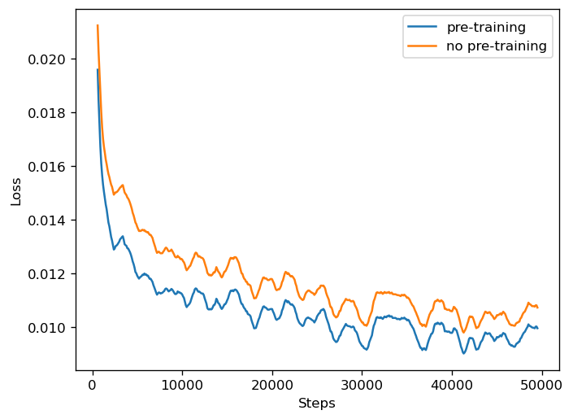

# MathLang

TL;DR: *Pre-pre-training language models with mathematical expressions as a cheap way to improve the performance of large language models.*

## Motivation

This projects provides dataloaders for mathematical expressions suitable for machine learning research. Mathematical expressions such as arithmetic, algebraic, or boolean expressions can be generated fast, at low cost, and with arbitrarily high complexity. Furthermore, these expressions come with short- and long-range dependencies, which makes them useful to train a neural network to learn interactions between tokens in a sequence.

## Mathematical Expressions

Mathematical expressions such as algebraic, arithmetic, or boolean expressions are well-suited for learning how to resolve complex relationships between items of a sequence encouraging a neural network to set terms into relation with each other, and perform sequential reasoning as these expressions are often nested and need to be resolved starting from the lowest level upwards. Solving arithmetic and boolean expressions, or simplifying complex algebraic expressions by expressing them in a more concise and manageable form also requires following a certain set of rules and techniques that the network needs to learn during training.

For example, the network must learn that brackets determine the processing order of terms or that terms far apart in the sequence can cancel each other out. In more detail, simplifying or solving mathematical expressions requires the network to learn the distributive, commutative, and associative laws, to simplify expressions within parentheses first (if necessary), then perform any exponents, followed by multiplication and division, and finally addition and subtraction. Last but not least, the network needs to learn to remove redundant brackets and sort (in case of solving algebraic expressions with *SymPy*) the simplified expression to arrive at its final form.

An [algebraic expression](https://en.wikipedia.org/wikiAlgebraic_expression) is a [mathematical expression](https://en.wikipedia.org/wiki/Expression_(mathematics)) that follows a well-formed syntax, carries semantic meaning, consists of terms, variables, constants, and mathematical operations such as addition, subtraction, multiplication, division, and exponentiation, and can look as follows:

$$
((3 \cdot x-6 \cdot z)-((x-1)-((1 \cdot y-(((7+x)+(8-z))-5 \cdot y))+1)-z))
$$

For the expression above, the network's task would be to compute a simplified version of the expression that is $x+6 \cdot y-4 \cdot z-13$. The simplification is performed using *SymPy*'s `simplify()` method. Note that `simplify()` also sorts the variables and adds the scalar term at the end of the simplified expression.

Algebraic expressions are a superset of arithmetic expressions such as

$$
3+6-(1+3)+((8-3)+((7-9)-(9+0)-(6+2))+(1-6))
$$

where the network's task is to compute the scalar result $-14$. Here, Python's `eval()` method is used in the dataet class to solve the expression. For the sake of simplicity, only operators for addition, subtraction, and multiplication are used for the generation of expressions.

Boolean expressions are composed of Boolean values, either `True` or `False`, or comparison operations, and logical connections that produce a Boolean value when evaluated. Here again, Python's built-in `eval()` method is used to evaluate the Boolean expression.

$$
((((4)\wedge(8>3)\vee((0>5)\wedge(((\text{False}))\vee((!\text{False}))))\wedge(1))\wedge(9<=2))\wedge((!\text{True}))) = \text{False}
$$

The ease of generating arbitrary complex mathematical expressions combined with their numerous interesting properties makes them an interesting choice for experiments wherever capabilities of networks are to be compared, novel network architectures tested, or for pre-training. Recent advances in natual language processing show, specifically the paper [Textbooks Are All You Need](https://arxiv.org/abs/2306.11644) with their *phi-1* model, some remarkable results from using syntethic data.

## Experiment

The following graph shows the loss of a transformer neural network trained on [TinyStories](https://arxiv.org/abs/2305.07759) without and with pre-training on arithmetic expressions for 1e5 iterations. First results show, that pre-training on mathematical expressions allows the model to converge faster and to achieve a lower loss.

<p align="center">
  
</p>

## Citation

If you find this project useful, please use BibTeX to cite it as:


```bibtex
@article{fischer2023mathlang,
  title   = "MathLang",
  author  = "Fischer, Kai",
  journal = "GitHub repository",
  year    = "2023",
  month   = "July",
  url     = "https://github.com/kaifishr/MathLang"
}
```

## License

MIT